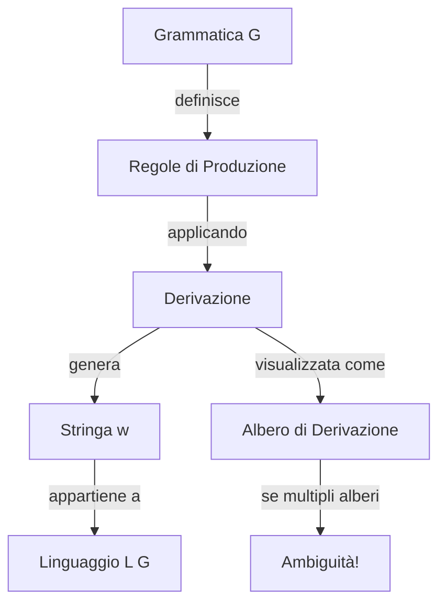

# Capitolo 2: Le Grammatiche Generative

## Introduzione

Le **grammatiche generative** sono uno strumento formale fondamentale per descrivere linguaggi (sia di programmazione che naturali). Servono a definire **regole** per costruire frasi valide in un linguaggio.

> [!note] Perché ci interessano?
> I compilatori usano le grammatiche per verificare se un programma è scritto correttamente. È come controllare se una frase italiana rispetta le regole grammaticali, solo che qui le regole sono più rigide e precise.

---

## 1. Cos'è una Grammatica Generativa

### Definizione Formale

Una **grammatica generativa** è una quadrupla: **G = (V, T, S, P)**

Dove:
- **V** = insieme dei **simboli non-terminali** (variabili, maiuscole: S, A, B, ...)
- **T** = insieme dei **simboli terminali** (caratteri finali: a, b, 0, 1, ...)
- **S** = **simbolo iniziale** (start symbol), da cui parte tutto (S ∈ V)
- **P** = insieme delle **produzioni** (regole di riscrittura)

### Intuizione

Pensa alla grammatica come a un **gioco di riscrittura**:
1. Parti dal simbolo S
2. Applichi le regole (produzioni) per sostituire simboli
3. Continui finché non ottieni solo caratteri terminali
4. Quello che ottieni è una **parola del linguaggio**

### Esempio Base

```
Grammatica:
S → aSb | ε

Cosa significa:
- S può diventare "aSb" (aggiungi 'a' a sinistra, 'b' a destra, tieni S in mezzo)
- Oppure S può diventare ε (stringa vuota, finisci qui)
```

**Cosa genera questa grammatica?**

```
S → ε             risultato: "" (stringa vuota)
S → aSb → ab      risultato: "ab"
S → aSb → aaSbb → aabb     risultato: "aabb"
S → aSb → aaSbb → aaaSbbb → aaabbb   risultato: "aaabbb"
```

Linguaggio generato: **{aⁿbⁿ | n ≥ 0}** 
(Tutte le stringhe con n volte 'a' seguite da n volte 'b')

> [!example] Analogia
> Pensa alle parentesi: ogni '(' deve essere chiusa da una ')'. Questa grammatica fa la stessa cosa con 'a' e 'b'!

---

## 2. Derivare il Linguaggio

### Il Processo di Derivazione

**Derivare** significa applicare le produzioni per ottenere una stringa.

Simbolo usato: `⟹` (si legge "deriva in")

#### Esempio di Derivazione

Grammatica:
```
S → aSb
S → ε
```

Sequenza di derivazione:
```
S ⟹ aSb ⟹ aaSbb ⟹ aabb
```

- Prima applicazione: S diventa aSb
- Seconda: sostituisco S con aSb → ottieni aaSbb  
- Terza: sostituisco S con ε → ottieni aabb

### Notazione Importante

| Simbolo | Significato |
|---------|-------------|
| ε | Stringa vuota (lunghezza 0) |
| aⁿ | Carattere 'a' ripetuto n volte |
| `⟹` | "deriva in" (un passo) |
| `⟹*` | "deriva in zero o più passi" |
| Maiuscole (S, A, B) | Non-terminali |
| Minuscole (a, b, c) | Terminali |

> [!warning] Attenzione!
> - ε non compare nelle parole finali (è "invisibile")
> - ε ha lunghezza zero: |ε| = 0
> - ε = εε = aº (per qualsiasi terminale a)

---

## 3. Esercizi di Derivazione

### Esercizio 1

**Grammatica:**
```
S → aAb
aA → aaAb
A → ε
```

**Analisi:**
- Parto sempre da S
- Prima produzione obbligata: S ⟹ aAb
- Poi posso scegliere:
  - `aA → aaAb` (aggiungi una 'a' e una 'b')
  - `A → ε` (termina)

**Linguaggio:** {aⁿbⁿ | n > 0}

### Esercizio 2

**Grammatica:**
```
S → AB
A → aA | a
B → Bb | b
```

**Analisi:**
- S ⟹ AB
- A genera almeno una 'a' (e poi quante vuoi)
- B genera almeno una 'b' (e poi quante vuoi)

**Linguaggio:** {aⁿbᵐ | n, m ≥ 1}

> [!example] Pattern comune
> Nota come A e B siano "generatori indipendenti" - A non influenza B e viceversa!

---

## 4. Tipi di Grammatiche (Gerarchia di Chomsky)

Esistono 4 tipi di grammatiche, in ordine decrescente di potenza:

| Tipo | Nome | Forma delle Produzioni | Esempio |
|------|------|------------------------|---------|
| **Tipo 0** | Illimitate | α → β (qualsiasi) | Troppo potenti, difficili |
| **Tipo 1** | Contestuali | αAβ → αγβ | Complesse |
| **Tipo 2** | **Libere** (CFG) | A → γ | **← Quelle che usiamo!** |
| **Tipo 3** | Regolari | A → aB o A → a | Più semplici (analisi lessicale) |

> [!note] Grammatiche Libere (Context-Free)
> Sono chiamate "libere dal contesto" perché puoi sostituire un non-terminale **indipendentemente** da cosa c'è intorno.
> 
> Esempio: `A → abc` significa che A diventa sempre abc, non importa cosa c'è prima o dopo!

**Le grammatiche Tipo 2 (libere) sono perfette per i linguaggi di programmazione!**

---

## 5. Derivazioni Canoniche

Quando derivi una stringa, devi scegliere **quale** non-terminale sostituire per primo. Due strategie standard:

### 5.1 Derivazione Leftmost (Sinistra)

**Regola:** Sostituisci sempre il **non-terminale più a sinistra**

```
Esempio con S → AB, A → a, B → b

S ⟹ AB     (sostituisco S)
  ⟹ aB     (sostituisco A, il più a sinistra)
  ⟹ ab     (sostituisco B)
```

### 5.2 Derivazione Rightmost (Destra)

**Regola:** Sostituisci sempre il **non-terminale più a destra**

```
Stesso esempio:

S ⟹ AB     (sostituisco S)
  ⟹ Ab     (sostituisco B, il più a destra)
  ⟹ ab     (sostituisco A)
```

> [!note] Perché sono importanti?
> Queste strategie rendono il processo **deterministico**: sai sempre quale simbolo sostituire!
> - I compilatori usano queste per costruire l'albero di parsing in modo prevedibile

---

## 6. Alberi di Derivazione (Parse Tree)

Un **albero di derivazione** è una rappresentazione grafica di come una stringa è stata generata.

### Struttura

- **Radice:** Simbolo iniziale S
- **Nodi interni:** Non-terminali
- **Foglie:** Terminali (o ε)

### Esempio

Grammatica: `S → aSb | ε`

Derivazione di "aaabbb":

```
        S
       /|\
      a S b
       /|\
      a S b
       /|\
      a S b
        |
        ε
```

Leggendo le foglie da sinistra a destra: **aaabbb** ✓

> [!important] Collegamento con i compilatori
> Quando compili un programma, il compilatore costruisce questo albero per capire la **struttura** del codice!

---

## 7. Ambiguità delle Grammatiche

### Definizione

Una grammatica è **ambigua** se esiste una stringa che può essere derivata in **due modi diversi** usando la stessa strategia canonica (entrambe leftmost o entrambe rightmost).

> [!warning] Problema serio!
> L'ambiguità è un problema perché significa che la stessa stringa può essere interpretata in modi diversi → il compilatore non sa cosa fare!

### 7.1 Esempio: Espressioni Aritmetiche

**Grammatica ambigua:**
```
E → E + E | E * E | n
```

**Problema:** Deriviamo `n + n * n`

#### Derivazione 1 (leftmost)

```
E ⟹ E + E
  ⟹ n + E
  ⟹ n + E * E
  ⟹ n + n * E
  ⟹ n + n * n
```

Albero 1:
```
      E
     /|\
    E + E
    |  /|\
    n E * E
      |   |
      n   n
```
Significa: `n + (n * n)` → moltiplicazione per prima

#### Derivazione 2 (leftmost diversa!)

```
E ⟹ E * E
  ⟹ E + E * E
  ⟹ n + E * E
  ⟹ n + n * E
  ⟹ n + n * n
```

Albero 2:
```
        E
       /|\
      E * E
     /|\  |
    E + E n
    |   |
    n   n
```
Significa: `(n + n) * n` → addizione per prima

> [!warning] Due alberi diversi = ambiguità!
> Questo è un problema perché il **risultato matematico è diverso**!
> - Prima interpretazione: 2 + 3*4 = 2 + 12 = 14
> - Seconda interpretazione: 2 + 3*4 = 5*4 = 20

**Come risolvere?** Serve una grammatica diversa che imponga la precedenza degli operatori!

### 7.2 Esempio: Dangling Else

**Grammatica:**
```
S → if b then S
  | if b then S else S
  | c
```

**Problema:** Deriva `if b then if b then c else c`

A quale `then` appartiene l'`else`?

#### Possibilità 1:
```
if b then (if b then c else c)
```

#### Possibilità 2:
```
if b then (if b then c) else c
```

Due alberi diversi → **ambiguità!**

> [!example] Soluzioni nei linguaggi reali
> I linguaggi di programmazione risolvono in vari modi:
> 1. **Parentesi obbligatorie** (Pascal, Ada)
> 2. **Eliminare `if-then`**, usare solo `if-then-else` (linguaggi funzionali)
> 3. **Regola del "closest unmatched then"** (C, Java): l'else va sempre col then più vicino non ancora accoppiato

---

## 8. Note sui Linguaggi Naturali

I linguaggi naturali (italiano, inglese, ecc.) sono **molto più ambigui** delle grammatiche per linguaggi di programmazione!

**Esempio di ambiguità in italiano:**
- "Ho visto un uomo con il telescopio"
  - Io ho usato il telescopio per vedere l'uomo?
  - Oppure l'uomo aveva un telescopio?

> [!note] Differenza fondamentale
> - **Linguaggi naturali:** Dipendono dal contesto, ambiguità tollerata
> - **Linguaggi di programmazione:** Grammatiche progettate per essere **non ambigue** e veloci da verificare (complessità lineare)

---

## 9. Errori Comuni e Chiarimenti

### ❌ Errore 1: Confondere terminali e non-terminali
- **Sbagliato:** "S è un carattere che appare nella stringa finale"
- **Corretto:** "S è un simbolo che viene sostituito durante la derivazione"

### ❌ Errore 2: Pensare che ε appaia nelle stringhe
- **Sbagliato:** La stringa finale è "aεb"
- **Corretto:** ε scompare, la stringa finale è "ab"

### ❌ Errore 3: Ambiguità = errore
- **Sfumatura:** Una grammatica ambigua non è "sbagliata", ma **non va bene per i compilatori**

### ❌ Errore 4: Confondere derivazione e linguaggio
- **Derivazione:** Il processo (i passi)
- **Linguaggio:** L'insieme di tutte le stringhe derivabili

---

## 10. Collegamenti ad Altri Concetti

### Link a concetti futuri (da approfondire):

- [[Proprietà dei Linguaggi Liberi]] (Capitolo 3)
- [[Parsing Top-Down]] - usa derivazioni leftmost
- [[Parsing Bottom-Up]] - usa derivazioni rightmost al contrario
- [[Automi a Pila]] - riconoscono linguaggi liberi
- [[Analisi Lessicale]] - usa grammatiche regolari (Tipo 3)

---

## Riepilogo Visivo



---

## Punti Chiave da Ricordare

1. ✅ Una grammatica **genera** un linguaggio attraverso produzioni
2. ✅ Leftmost/Rightmost rendono la derivazione **deterministica**
3. ✅ L'ambiguità è un **problema** per i compilatori
4. ✅ Le grammatiche **libere** (Tipo 2) sono perfette per linguaggi di programmazione
5. ✅ L'albero di derivazione mostra la **struttura** della stringa

---

## Domande per Auto-Valutazione

1. Cos'è la differenza tra un terminale e un non-terminale?
2. Perché usiamo derivazioni canoniche (leftmost/rightmost)?
3. Cosa significa che una grammatica è ambigua?
4. Perché l'ambiguità è un problema nei linguaggi di programmazione?
5. Cosa rappresenta ogni nodo in un albero di derivazione?

---

> [!tip] Prossimi Passi
> Ora che conosci le basi delle grammatiche, il prossimo capitolo approfondirà le **proprietà dei linguaggi liberi**: chiusura, pumping lemma, forme normali. Queste sono tecniche potenti per analizzare e trasformare grammatiche!