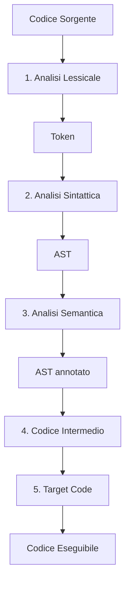

## Introduzione alla compilazione
# Compilatori - Capitolo 1: Introduzione

## Cos'è un Compilatore

> [!note] Definizione
> Un **compilatore** è un meccanismo che trasforma il **codice sorgente** (scritto in un linguaggio di programmazione) in **codice eseguibile** (comprensibile dalla macchina).

### Caratteristiche principali

- Il codice eseguibile è **machine-dependent**: ogni tipo di macchina ha il suo linguaggio macchina specifico
- I compilatori sono progetti complessi (es. `gcc` ha oltre 2 milioni di righe di codice!)
- La traduzione avviene attraverso più fasi intermedie

### Esempio classico

```text
Codice C → Assembly → Codice Binario → [Linking] → Eseguibile
```

> [!warning] Attenzione
> L'assembly NON è ancora codice eseguibile! Manca la conversione in binario (abbastanza semplice, corrispondenza quasi 1:1) e soprattutto la fase di **linking**.

---

## Le Fasi del Processo di Compilazione

> [!note] Pipeline di compilazione
> Le fasi sono presentate in sequenza, ma nella realtà vengono spesso **sovrapposte** per ragioni di efficienza.

### Due requisiti fondamentali

1. **Linguaggio specifico**: ogni linguaggio richiede il suo compilatore dedicato
2. **Rispetto della grammatica**: il codice deve seguire le regole sintattiche del linguaggio

> [!example] Grammatica
> La **grammatica** definisce la struttura legale delle operazioni. 
> 
> Esempio per un'assegnazione:
> ```
> Identifier Assign Expression Semicolon
> ```

---

## 1. Analisi Lessicale

> [!note] Cosa fa
> Traduce un **flusso di caratteri** in un **flusso di token**, riconoscendo il ruolo di ogni "stringa" del codice.

### Esempio pratico

**Input (codice sorgente):**
```c
pippo = 2*3;
```

**Output (token):**
```
<ID, pippo> ASS <NUM, 2> MUL <NUM, 3> SEMCOL
```

### Caratteristiche

- Identifica il **tipo** di ogni elemento (identificatore, numero, operatore, ecc.)
- **Non perde informazioni**: mantiene sia il tipo che il valore originale
- Si tratta di "capire chi è chi"

| Elemento | Token         | Descrizione                  |
| -------- | ------------- | ---------------------------- |
| `pippo`  | `<ID, pippo>` | Identificatore di variabile  |
| `=`      | `ASS`         | Operatore di assegnamento    |
| `2`      | `<NUM, 2>`    | Numero intero                |
| `*`      | `MUL`         | Operatore di moltiplicazione |
| `3`      | `<NUM, 3>`    | Numero intero                |
| `;`      | `SEMCOL`      | Punto e virgola              |

---

## 2. Analisi Sintattica

> [!note] Cosa fa
> Verifica che la **sequenza di token** rispetti la **grammatica** del linguaggio e costruisce una struttura ad albero.

### Output: Parse Tree

La sequenza di token viene tradotta in un **parse tree** (albero di parsing):

```
        ASS
       /   \
<ID,pippo> SEMCOL
            |
           MUL
          /   \
   <NUM,2>     <NUM,3>
```

### Abstract Syntax Tree (AST)

L'AST è una **versione semplificata** del parse tree, ottenuta rimuovendo nodi non necessari:

```
      ASS
     /   \
<ID,pippo> MUL
          /   \
      <NUM,2> <NUM,3>
```

> [!tip] Vantaggi dell'AST
> - Struttura più **minimale** → fasi successive più **efficienti**
> - Elimina informazioni ridondanti
> - In casi complessi il risparmio è significativo

### Syntax Error

> [!warning] Errori sintattici
> Gli errori di sintassi vengono rilevati in questa fase! Se il codice non rispetta la grammatica, il compilatore genera un **syntax error**.

### Nota importante

> [!note] Tree vs Grafo
> L'output è chiamato "tree" ma può diventare un **grafo** quando una variabile appare più volte.
> 
> Esempio: `pippo = pippo * 2`
> 
> ```
>       ASS
>      /   \
>   pippo   MUL
>           /   \
>        pippo   2
> ```
> 
> Qui `pippo` è collegato sia alla radice che al sottoalbero MUL.

---

## 3. Analisi Semantica

> [!note] Cosa fa
> Chiarisce il **significato** degli operatori e verifica la **coerenza dei tipi**.

### Esempio

In linguaggi con operatori **polimorfici** (stessa sintassi, significato diverso):

```c
2 * 3      // MUL tra interi
2.5 * 3.7  // MUL tra float
```

L'analisi semantica decide:
- Quale versione di `MUL` usare
- Se i tipi sono compatibili
- Se servono conversioni implicite

```
      MUL (int × int → int)
     /   \
<NUM,2>  <NUM,3>
```

> [!example] Altri controlli semantici
> - Verificare che le variabili siano dichiarate prima dell'uso
> - Controllare che i tipi nelle operazioni siano compatibili
> - Gestire conversioni di tipo (casting)

---

## 4. Generazione del Codice Intermedio

> [!note] Cosa fa
> Traduce l'AST in un **codice intermedio** leggibile dall'uomo ma indipendente dalla macchina.

### Esempio

**Parse tree:**
```
      ASS
     /   \
  ID     MUL
        /   \
       2     3
```

**Codice intermedio generato:**
```assembly
MOVE 2, R1      # Carica 2 nel registro R1
MULT 3, R1      # Moltiplica R1 per 3
MOVE R1, ID1    # Salva risultato nella variabile
```

### Caratteristiche

- **Non è assembly** definitivo
- **Non è codice eseguibile**
- È un livello di **astrazione intermedio**
- È **leggibile dall'uomo**

---

## 5. Generazione del Target Code

> [!note] Cosa fa
> Traduce il codice intermedio nel **linguaggio target** finale.

### Target possibili

Il target NON è necessariamente codice binario:

| Target               | Descrizione                                    |
| -------------------- | ---------------------------------------------- |
| **Assembly**         | Linguaggio assembly specifico della CPU target |
| **Bytecode**         | Per macchine virtuali (es. JVM, .NET)          |
| **Altro linguaggio** | Es. tradurre in C per usare poi `gcc`          |
| **Codice binario**   | File eseguibile diretto                        |

---

## Riassunto: Le 5 Fasi



### Tabella riassuntiva

| Fase | Input | Output | Scopo |
|------|-------|--------|-------|
| **1. Analisi Lessicale** | Caratteri | Token | Riconoscere elementi base |
| **2. Analisi Sintattica** | Token | AST | Verificare struttura grammaticale |
| **3. Analisi Semantica** | AST | AST annotato | Verificare significato e tipi |
| **4. Codice Intermedio** | AST | Codice intermedio | Astrazione indipendente |
| **5. Target Code** | Codice intermedio | Assembly/Binario | Codice per macchina specifica |

---

## Front-End vs Back-End

> [!note] Divisione del Compilatore
> Il compilatore si divide in due macro-componenti:

### Front-End
**Fasi 1-4**: Dall'analisi lessicale al codice intermedio
- Dipende dal **linguaggio sorgente**
- Indipendente dalla macchina target

### Back-End
**Fase 5**: Generazione del target code
- Dipende dalla **macchina target**
- Indipendente dal linguaggio sorgente

---

## Perché il Codice Intermedio?

> [!tip] Modularità
> Il codice intermedio serve come **livello di astrazione** per semplificare lo sviluppo.

### Il problema

- Abbiamo **N linguaggi** di programmazione
- Abbiamo **K architetture** di macchine diverse

**Senza codice intermedio:** servirebbero `N × K` compilatori diversi!

**Con codice intermedio:** servono solo `N + K` componenti:
- N front-end (uno per linguaggio)
- K back-end (uno per architettura)

### Schema

```
Linguaggio 1 ─┐
Linguaggio 2 ─┼──> [Front-End] ──> CODICE INTERMEDIO ──> [Back-End] ──┬─> Macchina 1
Linguaggio N ─┘                                                        ├─> Macchina 2
                                                                        └─> Macchina K
```

---

## Collegamenti e Approfondimenti

> [!note] Argomenti correlati
> - [[Grammatiche Formali]] - Come si definisce la grammatica di un linguaggio
> - [[Analisi Lessicale]] - Approfondimento su scanner e token
> - [[Analisi Sintattica]] - Parser e algoritmi di parsing
> - [[Symbol Table]] - Gestione degli identificatori
> - [[Ottimizzazione del Codice]] - Miglioramento del codice intermedio

---

## Note Importanti

> [!warning] Da ricordare
> - La grammatica del linguaggio deve essere **efficiente** da analizzare
> - Le fasi sono spesso **sovrapposte** per efficienza
> - Il parse tree può diventare un **grafo** con riferimenti multipli
> - Il codice intermedio è fondamentale per la **portabilità**

> [!example] Progetto di riferimento
> Durante il corso si usa spesso **GCC** come esempio:
> - In sviluppo da oltre 20 anni
> - Più di 2 milioni di righe di codice
> - Compilatore production-ready e altamente ottimizzato
