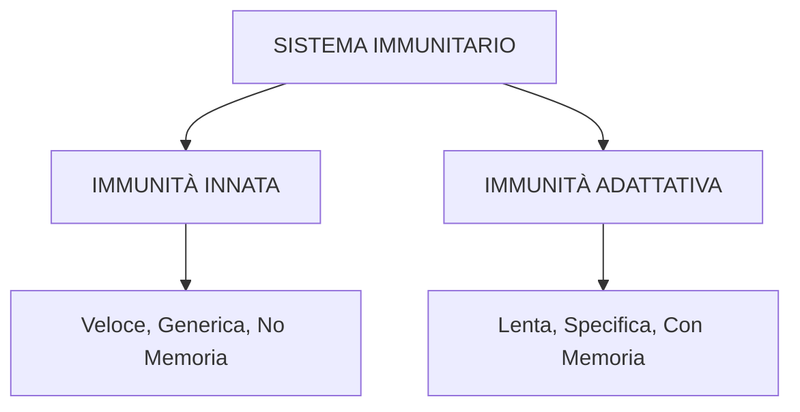

# SISTEMA IMMUNITARIO

## 📚 INDICE

1. [[#PARTE 1 - FONDAMENTI]]
2. [[#PARTE 2 - IMMUNITÀ INNATA]]
3. [[#PARTE 3 - IMMUNITÀ ADATTATIVA]]
4. [[#PARTE 4 - APPLICAZIONI CLINICHE]]
5. [[#DOMANDE DI AUTOVALUTAZIONE]]
6. [[#GLOSSARIO]]

---

# PARTE 1 - FONDAMENTI

## 🎯 Obiettivi di apprendimento
- [ ] Definire immunità e sistema immunitario
- [ ] Distinguere i tre tipi principali di patogeni
- [ ] Comprendere la differenza tra immunità innata e adattativa
- [ ] Spiegare il concetto di self vs non-self

---

## 1.1 Concetti Base

### Definizioni Fondamentali

**IMMUNITÀ**
Capacità di un organismo di difendersi da minacce interne:
- Microbi (batteri, virus, funghi, parassiti)
- Tossine microbiche
- Cellule tumorali (cellule del corpo mutate)

**SISTEMA IMMUNITARIO**
Insieme di cellule e organi che contribuiscono alle difese dell'organismo

**CONCETTO CHIAVE: Self vs Non-Self**
- **Self** = Molecole e cellule proprie dell'organismo
- **Non-Self** = Tutto ciò che è estraneo
- Il sistema immunitario deve distinguere tra i due!

> ⚠️ **Nota importante**: Quando il sistema attacca il self per errore → **Malattie autoimmuni**

---

## 1.2 I Tre Tipi di Patogeni

### Tabella Comparativa

| TIPO                    | STRUTTURA                  | REPLICAZIONE                                | COME DANNEGGIA                             | ESEMPI                          |
| ----------------------- | -------------------------- | ------------------------------------------- | ------------------------------------------ | ------------------------------- |
| **BATTERI**             | Cellule complete           | Autonoma                                    | Tossine, distruzione tessuti               | Infezioni pelle, tifo, colera   |
| **VIRUS**               | DNA/RNA + capside proteico | Dentro cellule ospiti (parassiti obbligati) | Uccisione cellule, trasformazione tumorale | HIV, COVID-19, influenza, Ebola |
| **PARASSITI EUCARIOTI** | Protisti, funghi, vermi    | Varia                                       | Sottrazione nutrienti, tossine             | Malaria, infezioni fungine      |

### Punti chiave sui Virus

**Caratteristiche uniche:**
- NON sono cellule complete
- DEVONO infettare una cellula ospite per replicarsi
- Usano i "macchinari" della cellula ospite
- Si nascondono DENTRO le cellule → più difficili da eliminare

**Strategie virali:**
- Uccisione rapida della cellula
- Latenza (dormienza per anni, es. Herpes)
- Trasformazione tumorale (Epstein-Barr, HPV)

**Vie di ingresso patogeni:**
- Contatto diretto
- Ferite aperte
- Inalazione (vie respiratorie)
- Ingestione (apparato digerente)

---

## 1.3 Due Tipi di Immunità

### Schema Generale



### Tabella Comparativa Completa

| CARATTERISTICA     | IMMUNITÀ INNATA                                 | IMMUNITÀ ADATTATIVA                        |
| ------------------ | ----------------------------------------------- | ------------------------------------------ |
| **Presente**       | Dalla nascita                                   | Si sviluppa dopo esposizione               |
| **Velocità**       | Immediata (minuti-ore)                          | Lenta (giorni-settimane)                   |
| **Specificità**    | GENERICA (stessa risposta per tutti i patogeni) | SPECIFICA (una risposta per ogni patogeno) |
| **Memoria**        | NO (sempre uguale)                              | SÌ (migliora ad ogni esposizione)          |
| **Riconoscimento** | Caratteristiche comuni (PAMPs)                  | Antigene specifico                         |
| **Esempi cellule** | Neutrofili, macrofagi, NK cells                 | Linfociti B e T                            |

### IMMUNITÀ INNATA (Nonspecifica)

**Principio:** "Attacca chiunque non abbia il badge"

**Caratteristiche:**
- ✅ Già presente alla nascita
- ✅ Risposta immediata
- ✅ Stessa risposta per batteri, virus, funghi, parassiti
- ❌ Non migliora con esposizioni ripetute

**Componenti principali:**
1. Barriere fisiche (pelle, muco)
2. Cellule fagocitiche
3. Infiammazione
4. Proteine antimicrobiche
5. Febbre

**Analogia:** Guardie armate che fermano chiunque senza distinguere chi è il nemico specifico

---

### IMMUNITÀ ADATTATIVA (Specifica)

**Principio:** "Detective che memorizza il volto del criminale"

**Caratteristiche:**
- ✅ Si sviluppa DOPO la prima esposizione
- ✅ Risposta specifica per OGNI patogeno
- ✅ Crea MEMORIA a lungo termine
- ✅ Esposizioni successive → risposta PIÙ VELOCE E FORTE

**Antigene** = Qualsiasi molecola riconosciuta come non-self (di solito proteine o grandi polisaccaridi)

**Componenti principali:**
- Linfociti B (producono anticorpi)
- Linfociti T (uccidono cellule infette, coordinano risposta)

**Sequenza temporale tipica:**

```
Giorno 0: Patogeno entra
    ↓
Giorni 0-1: Immunità INNATA risponde
    ↓
Giorni 2-7: Se innata non basta → Immunità ADATTATIVA si attiva
    ↓
Settimane 2+: Patogeno eliminato + MEMORIA creata
    ↓
Futuro: Stesso patogeno → Risposta ADATTATIVA immediata
```

---

## 📝 Punti Chiave Parte 1

✅ **Immunità** = difesa da microbi, tossine, cellule tumorali  
✅ **Batteri** = cellule complete; **Virus** = parassiti cellulari (più difficili da eliminare)  
✅ **Innata** = veloce, generica, no memoria  
✅ **Adattativa** = lenta, specifica, con memoria  
✅ Le DUE immunità **lavorano insieme** (innata prima, adattativa dopo)  
✅ **Self vs Non-Self** = distinzione fondamentale  

---

# PARTE 2 - IMMUNITÀ INNATA

## 🎯 Obiettivi di apprendimento
- [ ] Descrivere le barriere fisiche
- [ ] Identificare i leucociti dell'immunità innata e le loro funzioni
- [ ] Spiegare il processo infiammatorio
- [ ] Comprendere interferone e complemento
- [ ] Spiegare PAMPs e Toll-like receptors

---

## 2.1 Barriere Fisiche - Prima Linea di Difesa

### Le Tre Barriere

**1. PELLE**
- Pochissimi microorganismi penetrano pelle intatta
- Ghiandole secernono:
  - **Acidi deboli** (pH basso = ostile per microbi)
  - **Lisozima** (enzima che distrugge batteri)

**2. MUCOSE** (vie respiratorie e digestive)
- **Muco** = sostanza appiccicosa che:
  - Intrappola invasori
  - Contiene enzimi antimicrobici
- **Eliminazione** tramite:
  - Cellule fagocitiche
  - **Ciglia** che spazzano il muco verso faringe → ingoiato

**3. STOMACO**
- **Acidi gastrici** distruggono patogeni
- pH molto basso = letale per maggior parte microbi

> 💡 **Analogia**: Le barriere sono come un castello con mura (pelle), fossato con trappole (muco), e acido nei sotterranei (stomaco)

---

## 2.2 Cellule dell'Immunità Innata

### Leucociti (Globuli Bianchi)

**ORIGINE:** Tutti derivano da **cellule staminali ematopoietiche** nel midollo osseo

**DEFINIZIONE FAGOCITOSI:** Processo di endocitosi in cui le cellule englobano e distruggono particelle

> 📌 La fagocitosi è la difesa più antica - presente in TUTTI gli animali!

### Tabella Completa dei Leucociti Innati

| CELLULA | LOCALIZZAZIONE | FUNZIONE PRINCIPALE | NOTE |
|---------|----------------|---------------------|------|
| **Neutrofili** | Sangue | Fagocitano batteri, mediano infiammazione | Primi ad arrivare, più numerosi |
| **Monociti** | Sangue | Diventano macrofagi | Circolanti |
| **Macrofagi** | Tessuti | Fagocitosi potente, presentano antigeni | Monociti maturati |
| **Cellule Dendritiche** | Tessuti, linfonodi | Presentatori antigeni professionali | Ponte con adattativa |
| **Eosinofili** | Sangue, tessuti | Anti-parassiti, allergie | Rilasciano sostanze citotossiche |
| **Basofili** | Sangue | Istamina, eparina | Entrano in siti danneggiati |
| **Mastociti** | Tessuti | Istamina, infiammazione, allergie | Simili a basofili |
| **Natural Killer (NK)** | Sangue, tessuti | Uccidono cellule tumorali e infette | No riconoscimento specifico |

### Dettaglio Fagociti Professionisti

**NEUTROFILI**
- I più numerosi nel sangue
- Primi a raggiungere il sito di infezione
- Produzione aumenta drasticamente durante infezioni
- Vita breve (ore-giorni)

**MACROFAGI**
- Derivano da monociti
- Fagocitosi molto potente
- **Ruolo doppio:**
  1. Innata: fagocitano e distruggono
  2. Adattativa: presentano antigeni ai linfociti T

**CELLULE DENDRITICHE**
- Simili ai macrofagi
- **Presentatori di antigeni professionisti**
- Cruciali per attivare risposta adattativa

---

## 2.3 Infiammazione e Febbre

### Il Processo Infiammatorio

**DEFINIZIONE:** Risposta locale innata a infezione o danno tissutale

**OBIETTIVI:**
1. Distruggere/inattivare patogeni
2. Ripulire area da cellule morte
3. Preparare riparazione tissutale

**SINTOMI CLASSICI:**
- 🔴 Rossore (più sangue nell'area)
- 🌡️ Calore (sangue caldo affluisce)
- 💧 Gonfiore (accumulo liquido nei tessuti)
- ⚡ Dolore (pressione su terminazioni nervose)

### Sequenza degli Eventi

```
FASE 1: IL DANNO
Batterio entra attraverso ferita
    ↓
Mastociti secernono ISTAMINA
Cellule endoteliali secernono ossido nitrico (NO)
    ↓
VASODILATAZIONE (capillari si allargano)
PERMEABILITÀ AUMENTATA
    ↓
RISULTATO: Rossore + Calore

FASE 2: RECLUTAMENTO
Capillari permeabili permettono uscita di:
├─ Plasma → GONFIORE
└─ NEUTROFILI (primi ad arrivare!)
    ↓
Neutrofili rilasciano segnali
    ↓
Altri fagociti reclutati (macrofagi)
CITOCHINE amplificano risposta

FASE 3: BATTAGLIA
Neutrofili e macrofagi:
├─ Fagocitano batteri
├─ Li distruggono
└─ Man mano capillari tornano normali
    ↓
RISOLUZIONE
```

### Le Citochine - Messaggeri Chimici

**DEFINIZIONE:** Proteine segnale che coordinano risposta immunitaria

**FUNZIONI:**
- Reclutano altre cellule immunitarie
- Amplificano la risposta
- Coordinano innata e adattativa
- Attivano anche i linfociti

---

### Febbre - Risposta Sistemica

**DEFINIZIONE:** Temperatura corporea > 38°C (100.4°F negli umani)

**UTILITÀ:**
- Stimola attività leucociti
- Ambiente meno ospitale per patogeni

**MECCANISMO:**

```
Pirogeni (es. infezioni) entrano
    ↓
Cellule endoteliali/perivascolari attivano
    ↓
Rilascio PROSTAGLANDINA E2 (PGE2)
    ↓
PGE2 agisce su neuroni ipotalamo:
├─ Inibisce neuroni sensibili al caldo
└─ Attiva neuroni sensibili al freddo
    ↓
"Termostato" si sposta verso l'alto
    ↓
Corpo riduce dispersione calore
    ↓
TEMPERATURA AUMENTA
```

> 💡 **Curiosità**: Ecco perché con la febbre hai i brividi! Il corpo pensa di avere freddo perché il set-point è salito!

---

## 2.4 Proteine Antimicrobiche

### 1. SISTEMA DELL'INTERFERONE

**QUANDO SI ATTIVA:** Cellule infettate da virus

**MECCANISMO:**

```
Cellula infettata da virus
    ↓
Rilascia INTERFERONE
    ↓
Interferone raggiunge cellule vicine (NON infette)
    ↓
Cellule vicine attivano meccanismi antivirali
    ↓
INIBIZIONE REPLICAZIONE VIRALE
```

**CARATTERISTICHE:**
- ✅ NON specifico per un virus particolare (innato!)
- ✅ Protegge cellule circostanti
- ❌ Non uccide virus nella cellula già infetta

> 🔔 **Analogia**: Prima casa attaccata urla alle case vicine "Chiudete le porte! Arrivano i ladri!"

---

### 2. SISTEMA DEL COMPLEMENTO

**COMPOSIZIONE:** ~30 proteine nel plasma sanguigno che lavorano in cascata

**TRE VIE DI ATTIVAZIONE:**
1. **Via Classica** - Attivata da anticorpi (ponte con adattativa!)
2. **Via delle Lectine** - Lectine riconoscono carboidrati su patogeni
3. **Via Alternativa** - Attivazione spontanea su superfici microbiche

**TRE FUNZIONI PRINCIPALI:**

#### A) PROMUOVE INFIAMMAZIONE
- Stimola rilascio istamina dai mastociti
- Amplifica risposta infiammatoria

#### B) OPSONIZZAZIONE (Facilita Fagocitosi)
- Proteine complemento si attaccano ai patogeni
- Fagociti riconoscono meglio i patogeni "marcati"
- Come mettere un'etichetta fluorescente sul nemico!

#### C) UCCISIONE DIRETTA - Membrane Attack Complex (MAC)

```
Complemento attivato
    ↓
Forma MAC sulla membrana patogeno
    ↓
MAC crea BUCHI nella membrana
    ↓
H₂O e ioni entrano
    ↓
Patogeno esplode!
```

### Schema Riassuntivo Complemento

```
SISTEMA DEL COMPLEMENTO
    ↓
    ├─→ Infiammazione (istamina ↑)
    ├─→ Opsonizzazione (marca patogeni)
    └─→ MAC (lisi diretta)
         ↓
    Morte del patogeno
```

---

## 2.5 Riconoscimento dei Patogeni

### PAMPs - Le "Firme" dei Patogeni

**PAMPs = Pathogen-Associated Molecular Patterns**

**CONCETTO:**
- Patogeni hanno caratteristiche molecolari **comuni**
- Queste strutture sono **conservate** (essenziali per sopravvivenza patogeno)
- Non cambiano facilmente

**ESEMPI DI PAMPs:**
- **Lipopolisaccaride (LPS)** - membrana batteri Gram-negativi
- Lipidi, carboidrati, proteine microbiche
- **Flagellina** - proteina flagello batterico
- Acidi nucleici virali/batterici con strutture tipiche

> 💡 **Analogia**: Tutti i ladri hanno una pistola, tutti i pirati hanno una benda. Non serve conoscere il singolo ladro, basta riconoscere la pistola!

---

### Toll-Like Receptors (TLRs)

**STORIA DELLA SCOPERTA:**
- **1985** - Scoperta Toll-1 in Drosophila (moscerino)
- **1996** - Toll-1 conferisce resistenza a infezioni fungine!
- Trovati poi in molti animali e piante
- **Forse uno dei primi meccanismi immunitari mai evoluti**

**COSA SONO:**
- Recettori di membrana su cellule immunitarie
- Presenti su: macrofagi, cellule dendritiche, altri leucociti
- **Riconoscono PAMPs**

**COME FUNZIONANO:**

```
PAMP (es. LPS) si lega a TLR
    ↓
Attivazione secondi messaggeri
    ↓
    ├─→ FAGOCITOSI del patogeno
    └─→ Secrezione CITOCHINE
         ↓
         ├─→ Attivano altri leucociti (innata)
         └─→ Attivano linfociti (adattativa!)
```

**ESEMPIO:** TLR-4 riconosce LPS
- Topi mutanti TLR-4: difficoltà contro infezioni batteriche

### Perché PAMPs + TLRs è Geniale

**EFFICIENZA:**
- Non serve un recettore per OGNI batterio
- Pochi TLRs riconoscono categorie ampie di patogeni
- Riconoscono caratteristiche comuni (LPS, flagellina, ecc.)

**VELOCITÀ:**
- TLRs già presenti (non vanno "creati")
- Risposta immediata

**PONTE:**
- Attivano sia innata che adattativa

**CONFRONTO:**
- Adattativa: milioni di recettori diversi (uno per antigene)
- Innata: pochi TLRs (categorie ampie)

---

## 📝 Punti Chiave Parte 2

✅ **Barriere**: pelle, muco (con ciglia), acidi gastrici  
✅ **Leucociti**: neutrofili (primi), macrofagi (potenti), NK (tumori), eosinofili (parassiti)  
✅ **Infiammazione**: istamina → vasodilatazione → neutrofili → risoluzione  
✅ **Febbre**: PGE2 nell'ipotalamo → termostato ↑  
✅ **Interferone**: cellule infette proteggono vicine da virus  
✅ **Complemento**: infiammazione + opsonizzazione + MAC  
✅ **PAMPs + TLRs**: riconoscimento rapido, generico ma efficace  
✅ **Citochine**: coordinano tutto, ponte innata-adattativa  

---

# PARTE 3 - IMMUNITÀ ADATTATIVA

## 🎯 Obiettivi di apprendimento
- [ ] Descrivere il sistema linfatico e circolazione linfociti
- [ ] Spiegare come funzionano i linfociti B (anticorpi)
- [ ] Spiegare come funzionano i linfociti T (cellulo-mediata)
- [ ] Comprendere MHC/HLA e presentazione antigeni
- [ ] Spiegare la memoria immunologica

---

## 3.1 Sistema Linfatico

### Il Sistema di Drenaggio

**COLLEGAMENTO CON CIRCOLATORIO:**
- Sangue circola nei vasi sanguigni
- Fluidi escono dai capillari nei tessuti
- La maggior parte rientra nei capillari venosi
- **MA**: Una parte resta nei tessuti = **liquido interstiziale**

**RUOLO SISTEMA LINFATICO:**
- Raccoglie il liquido interstiziale
- Lo trasforma in **linfa**
- Lo riporta al sangue

```
Liquido interstiziale
    ↓
Vasi linfatici (capillari → vasi → dotti)
    ↓
LINFA (liquido nei vasi linfatici)
    ↓
Passa attraverso LINFONODI (checkpoint)
    ↓
Continua verso dotti linfatici maggiori
    ↓
Ritorna al sangue (vena succlavia)
```

> 🔄 Sistema linfatico = sistema di drenaggio parallelo al circolatorio

---

### Organi Linfatici

**ORGANI PRIMARI** (Addestramento)
- **Midollo osseo**: Nascono TUTTI i linfociti
- **Timo**: Linfociti T maturano e "imparano" a non attaccare il self

**ORGANI SECONDARI** (Lavoro)
- **Linfonodi**: Stazioni di filtraggio della linfa
- **Milza**: Filtra il sangue
- **Tonsille**: Proteggono vie respiratorie
- Altre aggregazioni sparse

### Linfonodi - Checkpoint Immunitari

**STRUTTURA:**
- Rete fitta di linfociti (B e T) e macrofagi
- La linfa passa ATTRAVERSO

**FUNZIONE:**
```
Linfa con antigeni entra
    ↓
Passa attraverso rete di linfociti
    ↓
Se un linfocito riconosce il SUO antigene:
    → SI ATTIVA
    → PROLIFERA
    ↓
Linfa filtrata esce
```

**PERCHÉ SI GONFIANO:**
- Durante infezione (es. gola)
- Linfociti proliferano massicciamente
- Linfonodi si riempiono di cellule
- GONFIORE = risposta immunitaria attiva!

---

### Circolazione dei Linfociti

**IL CICLO CONTINUO:**

```
Linfociti in organi secondari
    ↓
Escono → Sangue
    ↓
Sangue → Escono nelle venule
    ↓
Liquido interstiziale
    ↓
Vasi linfatici
    ↓
Passano attraverso linfonodi
    ↓
Ritornano al sangue
    ↓
Ricomincia il ciclo
```

**PERCHÉ CIRCOLANO:**
- Ogni linfocito riconosce UN antigene specifico
- Se stanno fermi, come trovano il loro nemico?
- **Circolazione continua = aumenta probabilità di incontrare l'antigene giusto**

---

## 3.2 Linfociti - I Protagonisti

### I Tre Tipi

| TIPO | MATURAZIONE | FUNZIONE | MECCANISMO |
|------|-------------|----------|------------|
| **Linfociti B** | Midollo osseo | Producono ANTICORPI | Immunità umorale |
| **Linfociti T** | Timo | Uccidono cellule infette, coordinano | Immunità cellulo-mediata |
| **Linfociti T regolatori** | Timo | Frenano la risposta | Prevenzione autoimmunità |

> 💡 **Nota**: "Umorale" = nel fluido/umore (anticorpi circolano liberi)

---

## 3.3 Linfociti B - Immunità Umorale

### Selezione Clonale - Il Meccanismo Geniale

**IL PROBLEMA:**
- Hai milioni di linfociti B diversi
- Ognuno con anticorpo specifico
- Entra un batterio
- Come trovare e attivare SOLO i linfociti B giusti?

**LA SOLUZIONE:**

```
STEP 1: BCR (B Cell Receptors)
Ogni linfocito B ha anticorpi "ancorati" sulla membrana
Funzionano come antenne

STEP 2: Incontro Specifico
Antigene circola
Passa vicino a MIGLIAIA di linfociti B
La maggior parte lo ignora
UNO (o pochi) lo riconoscono! (chiave-serratura)

STEP 3: Attivazione
Il linfocito B che ha legato l'antigene si ATTIVA

STEP 4: Proliferazione Clonale
Si divide rapidamente
Fa migliaia di COPIE (cloni)
Tutti i cloni = stesso recettore

STEP 5: Differenziamento
├─ 90% → PLASMACELLULE (producono anticorpi)
└─ 10% → MEMORY B CELLS (memoria)
```

### Plasmacellule - Le Fabbriche

**CARATTERISTICHE:**
- Producono anticorpi a ritmo pazzesco: **2000 molecole/SECONDO**
- Vita breve (giorni/settimane)
- Rilasciano anticorpi nel sangue/linfa
- Muoiono dopo aver fatto il lavoro

**ANTICORPI RILASCIATI:**
- Identici ai BCR
- Circolano liberamente
- Cercano il loro antigene ovunque

---

### Anticorpi - Struttura e Funzione

**STRUTTURA BASE:**
- Forma a Y
- 2 "braccia" identiche (riconoscono antigene)
- 1 "gambo" (comunica con altre cellule immunitarie)

**LE 4 FUNZIONI:**

#### 1. NEUTRALIZZAZIONE
```
Anticorpo si lega a virus/tossina
    ↓
Lo "maschera"
    ↓
Virus/tossina non può legarsi a cellule
    ↓
Infezione bloccata
```

#### 2. AGGLUTINAZIONE
```
Ogni anticorpo ha 2 braccia
    ↓
Può legare 2 antigeni contemporaneamente
    ↓
Forma grandi ammassi di patogeni
    ↓
Più facili da fagocitare
```

#### 3. ATTIVAZIONE COMPLEMENTO
```
Anticorpi legati a patogeni
    ↓
Attivano sistema complemento
    ↓
Complemento → MAC
    ↓
Buchi → Morte patogeno
```

#### 4. OPSONIZZAZIONE
```
Anticorpi "marcano" patogeni
    ↓
Fagociti riconoscono meglio i marcati
    ↓
Fagocitosi più efficiente
```

> 📌 **Importante**: Gli anticorpi NON uccidono direttamente! Marcano e attivano altri sistemi.

---

### Memory B Cells - La Memoria

**CARATTERISTICHE:**
- Vita LUNGA (anni/decenni/vita intera)
- Restano in circolo pronte
- Incontro con stesso antigene → attivazione RAPIDISSIMA

**RISPOSTA PRIMARIA vs SECONDARIA:**

| CARATTERISTICA | PRIMARIA (1ª esposizione) | SECONDARIA (2ª esposizione) |
|----------------|---------------------------|----------------------------|
| **Tempo** | 7-14 giorni | 2-7 giorni |
| **Quantità anticorpi** | Bassa | ALTA |
| **Sintomi** | Forti (sei malato) | Assenti o lievi |
| **Motivo** | Deve selezionare e clonare | Memory già pronte! |

```
PRIMA VOLTA:
Antigene → Selezione (giorni) → Clonazione (giorni) 
→ Plasmacellule → Anticorpi (lento, pochi) + Memory

SECONDA VOLTA:
Antigene → Memory riconoscono SUBITO → Clonazione rapida 
→ Plasmacellule → Anticorpi (veloce, TANTI)
```

---

## 3.4 Linfociti T - Immunità Cellulo-Mediata

### Il Problema dei Virus Nascosti

**RICORDA:**
- Anticorpi circolano nel sangue/linfa
- NON possono entrare nelle cellule
- Virus nascosto in cellula = INVISIBILE agli anticorpi

**DOMANDA:** Come eliminare un virus dentro una cellula?
**RISPOSTA:** Linfociti T!

---

### I Tre Tipi di Linfociti T

| TIPO | MARKER | FUNZIONE | RICONOSCE |
|------|--------|----------|-----------|
| **Helper T (Th)** | CD4+ | Coordinatori, attivano tutto | Antigeni su MHC-II |
| **Citotossici T (Tc)** | CD8+ | Killer, uccidono cellule infette | Antigeni su MHC-I |
| **Regolatori T (Treg)** | CD4+ CD25+ | Frenano risposta | Vari segnali |

---

### T CITOTOSSICI - Gli Assassini

**BERSAGLI:**
- Cellule infettate da virus
- Cellule tumorali

**MECCANISMO:**

```
STEP 1: Riconoscimento
T citotossico riconosce cellula infetta (tramite MHC-I)

STEP 2: Attacco
Si attacca alla cellula bersaglio

STEP 3: Rilascio Armi
├─ PERFORINA → crea pori nella membrana
└─ GRANZIMI → entrano e inducono APOPTOSI

STEP 4: Morte Programmata
Cellula infetta muore
Virus muore con lei
```

> ⚠️ **Sacrificio necessario**: Uccidono una TUA cellula per salvare il corpo!

---

### HELPER T - I Coordinatori

**RUOLO:** Non uccidono, ma orchestrano TUTTA la risposta

**LE 4 FUNZIONI:**

1. **Aiutano Linfociti B**
   - Rilasciano citochine
   - B cells si attivano completamente
   - Più anticorpi prodotti

2. **Attivano T Citotossici**
   - Amplificano risposta citotossica

3. **Attivano Macrofagi**
   - Li rendono più efficienti

4. **Coordinano Generale**
   - Dirigono tutta l'orchestra immunitaria

> 🚨 **CRUCIALE**: Senza Helper T, immunità adattativa CROLLA!  
> Ecco perché HIV è devastante - infetta proprio gli Helper T!

---

### T REGOLATORI - I Freni

**RUOLO:** SPEGNERE la risposta quando non serve più

**PERCHÉ SERVONO:**
- Senza freni, sistema continuerebbe ad attaccare anche dopo aver vinto
- Prevengono **autoimmunità**
- Mantengono equilibrio

---

## 3.5 Presentazione Antigeni - MHC/HLA

### Il Grande Problema

**COME VEDONO I T CELLS COSA C'È DENTRO LE CELLULE?**

- Linfociti B: riconoscono antigeni LIBERI nel sangue/linfa
- Linfociti T: devono riconoscere cosa c'è DENTRO le cellule

**SOLUZIONE GENIALE:** Le cellule "mettono in vetrina" campioni!

---

### MHC = Cartellini d'Identità Molecolari

**MHC = Major Histocompatibility Complex**  
**HLA = Human Leukocyte Antigen** (nome negli umani)

**PRINCIPIO:**
- Ogni cellula ha proteine MHC sulla superficie
- MHC mostrano frammenti proteici interni
- Come un "campionario" di cosa c'è dentro

---

### DUE CLASSI DI MHC

#### MHC CLASSE I (su TUTTE le cellule nucleate)

**COSA MOSTRANO:** Frammenti di proteine prodotte DENTRO la cellula

**ESEMPI:**

| SITUAZIONE | MHC-I MOSTRA | T CITOTOSSICO FA |
|------------|--------------|------------------|
| Cellula sana | Proteine self normali | Ignora ✓ |
| Cellula infetta virus | Proteine virali | UCCIDE ⚔️ |
| Cellula tumorale | Proteine anomale | UCCIDE ⚔️ |

**CHI CONTROLLA:** Linfociti T **CITOTOSSICI** (CD8+)

```
Cellula infetta:
Virus dentro → proteine virali prodotte 
→ frammenti su MHC-I → T citotossico riconosce 
→ APOPTOSI
```

---

#### MHC CLASSE II (solo Cellule Presentatrici Professionali)

**CHI LE HA:**
- Macrofagi
- Cellule dendritiche
- Linfociti B

**COSA MOSTRANO:** Frammenti di proteine FAGOCITATE dall'esterno

**PROCESSO:**

```
STEP 1: Macrofago fagocita batterio
    ↓
STEP 2: Digerisce il batterio
    ↓
STEP 3: Prende frammenti e li mostra su MHC-II
    ↓
STEP 4: Helper T (CD4+) riconosce antigene
    ↓
STEP 5: Helper T si ATTIVA
    ↓
STEP 6: Helper T coordina risposta
    (attiva B cells, T citotossici, macrofagi)
```

**CHI CONTROLLA:** Linfociti T **HELPER** (CD4+)

---

### Schema Comparativo MHC

| CARATTERISTICA | MHC-I | MHC-II |
|----------------|-------|--------|
| **Dove** | Tutte cellule nucleate | Solo APC (macrofagi, dendritiche, B) |
| **Mostra** | Proteine prodotte DENTRO | Proteine FAGOCITATE |
| **Controllato da** | T citotossici (CD8+) | Helper T (CD4+) |
| **Risultato** | Apoptosi cellula infetta | Coordinamento risposta |

> 💡 **Analogia**: MHC-I = "Ecco cosa produco io", MHC-II = "Ecco cosa ho mangiato"

---

## 3.6 Collaborazione T-B

### Come Lavorano Insieme

**SEQUENZA COMPLETA:**

```
STEP 1: Batterio entra
    ↓
STEP 2: Macrofago lo fagocita
    ↓
STEP 3: Macrofago presenta su MHC-II
    ↓
STEP 4: Helper T riconosce → SI ATTIVA
    ↓
STEP 5: Linfocita B cattura stesso antigene (BCR)
    ↓
STEP 6: B presenta antigene su MHC-II
    ↓
STEP 7: Helper T (già attivato) incontra B
    └─→ Rilascia CITOCHINE
    ↓
STEP 8: B riceve segnale completo
    └─→ PROLIFERAZIONE CLONALE massima!
    └─→ Plasmacellule + Memory B
    ↓
STEP 9: Anticorpi eliminano batteri
```

> 🔑 **CHIAVE**: Linfociti B hanno bisogno dell'AIUTO degli Helper T per attivarsi completamente!

---

## 3.7 Memoria Immunologica

### Risposta Primaria vs Secondaria

**GRAFICO CONCETTUALE:**

```
ANTICORPI
    │
    │      2ª ESPOSIZIONE
    │          /\
    │         /  \
    │        /    \___
    │   1ª  /
    │   /\ /
    │  /  \/
    │_/_____________ TEMPO
   0  7  14  21  28 giorni
```

### Tabella Comparativa Dettagliata

| ASPETTO | RISPOSTA PRIMARIA | RISPOSTA SECONDARIA |
|---------|-------------------|---------------------|
| **Velocità** | Lenta (7-14 giorni) | Veloce (2-7 giorni) |
| **Picco anticorpi** | Basso | ALTO (10-100x maggiore) |
| **Durata fase latente** | Lunga | Breve |
| **Sintomi** | Forti (malato!) | Assenti o lievi |
| **Motivo** | Deve selezionare e clonare | Memory già pronte! |

### Sequenza Temporale Dettagliata

**PRIMA ESPOSIZIONE:**
```
Giorno 0: Antigene entra
    ↓
Giorni 1-7: Selezione linfociti giusti + proliferazione
    ↓
Giorni 7-14: Produzione anticorpi (lenta, picco basso)
    SINTOMI EVIDENTI
    ↓
Settimane 2-4: Eliminazione patogeno
    Memory cells create
    Anticorpi diminuiscono
```

**SECONDA ESPOSIZIONE:**
```
Giorno 0: STESSO antigene
    ↓
Ore-Giorni 1-3: Memory riconoscono SUBITO
    Proliferazione RAPIDA
    ↓
Giorni 3-7: Produzione anticorpi MASSICCIA (picco alto)
    Patogeno eliminato PRIMA dei sintomi
    ↓
Risultato: ASINTOMATICO o lievi sintomi
```

### Durata della Memoria

**VARIA A SECONDA DEL PATOGENO:**
- Morbillo: **vita intera**
- Varicella: **decenni**
- Influenza: **meno duratura** (virus muta)
- Tetano: **10 anni** (serve richiamo)

---

## 📝 Punti Chiave Parte 3

✅ **Sistema linfatico**: raccoglie linfa, passa per linfonodi, torna al sangue  
✅ **Linfociti B**: selezione clonale → plasmacellule (anticorpi) + memory B  
✅ **Anticorpi**: neutralizzazione, agglutinazione, complemento, opsonizzazione  
✅ **Linfociti T Helper**: coordinano TUTTO (senza loro, sistema crolla!)  
✅ **Linfociti T Citotossici**: uccidono cellule infette (perforina + granzimi → apoptosi)  
✅ **MHC-I**: tutte cellule, mostrano proteine interne → T citotossici  
✅ **MHC-II**: APC, mostrano proteine fagocitate → T helper  
✅ **Memoria**: 1ª volta lenta, 2ª volta veloce e forte  
✅ **Collaborazione T-B**: Helper T attiva completamente i B cells  

---

# PARTE 4 - APPLICAZIONI CLINICHE

## 🎯 Obiettivi di apprendimento
- [ ] Distinguere i tipi di vaccini
- [ ] Comprendere immunità attiva vs passiva
- [ ] Spiegare malattie autoimmuni
- [ ] Comprendere allergie e ipersensibilità
- [ ] Spiegare rigetto trapianti e HLA
- [ ] Comprendere HIV/AIDS

---

## 4.1 Vaccinazioni

### Principio Base

**OBIETTIVO:** Creare memoria immunologica SENZA causare malattia

**REQUISITI DI UN VACCINO:**
- ✅ Attiva sistema immunitario
- ❌ NON causa malattia
- ✅ Sicuro
- ✅ Crea memoria a lungo termine

---

### Tipi di Vaccini

#### 1. VACCINI CELLULARI ATTENUATI (Vivi ma indeboliti)

**STRATEGIA:** Patogeno VIVO ma **attenuato** (indebolito in laboratorio)

**PRO:**
- ✅ Immunità FORTE e DURATURA
- ✅ Spesso bastano 1-2 dosi
- ✅ Il patogeno si replica un po' → stimola molto

**CONTRO:**
- ❌ Piccolo rischio ritorno virulenza
- ❌ Non per immunodepressi

**ESEMPI:** Morbillo, parotite, rosolia, varicella

---

#### 2. VACCINI CELLULARI INATTIVATI (Uccisi)

**STRATEGIA:** Patogeno MORTO (calore o sostanze chimiche)

**PRO:**
- ✅ SICURO (zero rischio infezione)
- ✅ OK per immunodepressi

**CONTRO:**
- ❌ Immunità più DEBOLE
- ❌ Servono dosi multiple e richiami

**ESEMPI:** Polio (Salk), influenza iniettabile, epatite A

---

#### 3. VACCINI ACELLULARI (Solo componenti)

**STRATEGIA:** NON usare patogeno intero, solo PEZZI (antigeni purificati)

##### A) Proteine/Peptidi Ricombinanti
- Si produce UNA proteina chiave in laboratorio
- Si inietta SOLO quella
- **Esempi:** Epatite B, HPV

##### B) Vaccini a DNA
- Si inietta DNA che codifica per un antigene
- Cellule del paziente leggono DNA e producono antigene
- Sistema risponde

##### C) Vaccini a mRNA (INNOVAZIONE!)
- Si inietta mRNA che codifica per antigene
- Cellule traducono mRNA → producono antigene
- mRNA si degrada rapidamente (NON entra nel DNA!)
- **Esempi:** COVID-19 (Pfizer, Moderna)

**PRO ACELLULARI:**
- ✅ MASSIMA SICUREZZA
- ✅ Nessun patogeno
- ✅ mRNA: produzione rapidissima

**CONTRO:**
- ❌ Immunità meno duratura

---

### Tabella Comparativa Vaccini

| TIPO | SICUREZZA | EFFICACIA | DURATA | DOSI | ESEMPI |
|------|-----------|-----------|--------|------|--------|
| **Attenuato** | Media | Alta | Lunga | 1-2 | Morbillo |
| **Inattivato** | Alta | Media | Media | Multiple | Influenza |
| **Proteine** | Altissima | Media | Media | Multiple | Epatite B |
| **mRNA** | Altissima | Alta | Da valutare | 2-3 | COVID-19 |

---

### Immunità Attiva vs Passiva

#### IMMUNITÀ ATTIVA
= Il TUO corpo produce anticorpi

**NATURALE:**
- Ti ammali
- Guarisci
- Hai memoria

**ARTIFICIALE:**
- Vaccino
- Tuo corpo crea anticorpi e memoria

**CARATTERISTICHE:**
- ⏱️ Lenta (giorni/settimane)
- 📈 Duratura (anni/vita)
- 🧠 Con memoria

---

#### IMMUNITÀ PASSIVA
= Ricevi anticorpi GIÀ PRONTI da altri

**NATURALE:**
- Madre → feto (placenta)
- Madre → neonato (latte materno)

**ARTIFICIALE:**
- Iniezione immunoglobuline (IgG)
- Anticorpi monoclonali

**QUANDO SI USA:**
- Dopo esposizione epatite/rabbia
- COVID-19 grave
- Terapie anti-tumorali

**CARATTERISTICHE:**
- ⚡ Immediata (protetto subito!)
- ⏰ Breve (settimane/mesi, anticorpi si degradano)
- ❌ NO memoria

---

### Anticorpi Monoclonali

**COSA SONO:** Anticorpi prodotti in laboratorio, tutti IDENTICI, specifici per UN antigene

**PRODUZIONE:**
```
Immunizza topo con antigene
    ↓
Preleva linfociti B dal topo
    ↓
Fonde con cellule tumorali (immortali)
    ↓
IBRIDOMA (produce anticorpi all'infinito)
```

**USI CLINICI:**
- Terapie contro cancro
- COVID-19 grave
- Malattie autoimmuni

---

## 4.2 Malattie Autoimmuni

### Definizione

**AUTOIMMUNITÀ:** Sistema immunitario attacca tessuti e cellule del **proprio corpo** (self)

**IL PROBLEMA:** Perdita della capacità di distinguere self da non-self

---

### Esempi Principali

| MALATTIA | BERSAGLIO | RISULTATO | TERAPIA |
|----------|-----------|-----------|---------|
| **Diabete Tipo 1** | Cellule β pancreas (insulina) | Glicemia alta | Iniezioni insulina vita |
| **Sclerosi Multipla** | Mielina (guaina neuroni) | Problemi neurologici | Immunosoppressori |
| **Artrite Reumatoide** | Articolazioni | Infiammazione, dolore, deformità | Anti-infiammatori |
| **Lupus Eritematoso** | Multipli organi | Danni diffusi | Immunosoppressori |
| **Miastenia Gravis** | Recettori acetilcolina | Debolezza muscolare | Farmaci potenzianti ACh |

---

### Approcci Terapeutici

**TRE STRATEGIE:**

1. **Trattare sintomi**
   - Es. insulina per diabete
   - Non cura, gestisce

2. **Sopprimere sistema immunitario**
   - **PRO:** Riduce attacco
   - **CONTRO:** Maggior rischio infezioni

3. **Trapianto cellule staminali ematopoietiche**
   - "Reset" sistema immunitario
   - Procedura rischiosa
   - Solo per casi gravi

---

## 4.3 Allergie

### Definizione

**ALLERGIA:** Risposta immunitaria **eccessiva** a sostanze ambientali innocue

**ALLERGENI:** Antigeni che causano allergie
- Pollini
- Peli animali
- Acari polvere
- Cibi (arachidi, latte, uova)
- Veleno insetti

> 💡 **Punto chiave**: Gli allergeni sono INNOCUI! Il problema è la risposta eccessiva.

---

### Due Tipi di Ipersensibilità

#### 1. IPERSENSIBILITÀ RITARDATA (giorni)

**ESEMPIO:** Edera velenosa

**MECCANISMO:**
- Linfociti T riconoscono allergene
- Rilasciano citochine
- Infiammazione locale
- Sviluppo in 2-3 giorni

---

#### 2. IPERSENSIBILITÀ IMMEDIATA (minuti) - Più pericolosa!

**MECCANISMO IN DUE FASI:**

##### FASE 1: SENSIBILIZZAZIONE (prima esposizione)

```
Prima esposizione all'allergene
    ↓
Linfociti B producono IgE (invece di IgG!)
    ↓
IgE si attaccano ai MASTOCITI
    ↓
Mastociti ora "armati" con IgE
    ↓
NESSUN SINTOMO (solo preparazione)
```

> 💡 **Analogia**: Installare un allarme in casa - lo prepari ma non suona

##### FASE 2: REAZIONE ALLERGICA (esposizioni successive)

```
Allergene entra DI NUOVO
    ↓
Si lega agli IgE sui mastociti
    ↓
Questo è il SEGNALE!
    ↓
Mastociti DEGRANULANO
    ↓
ISTAMINA rilasciata in massa
    ↓
EFFETTI:
├─ Aumento secrezione muco
├─ Aumento flusso sanguigno
├─ Gonfiore epitelio
└─ Contrazione muscoli lisci vie aeree
    ↓
SINTOMI:
├─ Congestione nasale
├─ Naso che cola
├─ Starnuti
├─ Difficoltà respiratoria
└─ Può portare ad ASMA
```

---

### Terapie

**ANTISTAMINICI:**
- Bloccano RECETTORI istamina
- NON prevengono degranulazione
- NON prevengono rilascio istamina
- Prevengono EFFETTI dell'istamina

> 💊 **Analogia**: Tappi per orecchie - il rumore (istamina) c'è ancora, ma non lo senti

**SHOCK ANAFILATTICO:**
- Reazione grave, potenzialmente letale
- **Trattamento:** Adrenalina (EpiPen)
  - Contrae vasi sanguigni
  - Apre vie aeree
- EMERGENZA MEDICA!

---

### Teoria Evolutiva

**PERCHÉ ESISTONO ALLERGIE?**

**Ipotesi:**
- IgE si sono evoluti per combattere **parassiti** (vermi)
- Società moderne: poca esposizione a parassiti
- Sistema immunitario "sbaglia bersaglio" verso sostanze innocue
- **Predisposizione genetica**: se genitori allergici, più probabilità

---

## 4.4 Trapianti e Rigetto

### Il Problema del Rigetto

**DATI:** 28.500 trapianti/anno in USA
- Più comuni: reni, fegato, cuore, polmoni

**PROBLEMA PRINCIPALE:** RIGETTO DEL TRAPIANTO

**CAUSA:** MHC/HLA diversi tra donatore e ricevente

---

### HLA - Variabilità Genetica

**HLA = Human Leukocyte Antigen**  
(MHC negli umani)

**CARATTERISTICHE:**

1. **Polimorfismo estremo**
   - Moltissime varianti (alleli)
   - Ogni persona ha "firma HLA" quasi unica

2. **Localizzazione**
   - Tutti geni HLA su cromosoma 6

3. **Codominanza**
   - Esprimi HLA di entrambi i genitori

> 🧬 **Analogia**: HLA come impronte digitali molecolari - quasi uniche per ogni persona

---

### Meccanismo del Rigetto

```
Organo trapiantato (HLA diversi)
    ↓
Linfociti T del ricevente riconoscono come "non-self"
    ↓
├─ T citotossici attaccano cellule trapianto
└─ Helper T coordinano risposta
    ↓
Infiammazione e distruzione
    ↓
RIGETTO
```

---

### Tipi di Antigeni nel Rigetto

**1. HLA (Antigeni Maggiori)**
- Causa PIÙ IMPORTANTE
- Rigetto rapido e robusto
- Differenze HLA → rigetto quasi certo

**2. Antigeni Minori**
- Varianti alleliche proteine normali
- Rigetto lento e debole

**3. Altri Alloantigeni**
- Gruppo sanguigno ABO
- Antigeni tessuto-specifici

---

### Compatibilità e Gestione

**TROVARE DONATORE COMPATIBILE:**
- Compatibilità perfetta = gemelli identici
- Compatibilità alta = fratelli/sorelle (~50% probabilità)
- Compatibilità bassa = non parenti

**PROBLEMA:** Variabilità HLA estrema → difficile trovare donatori

**TERAPIA IMMUNOSOPPRESSIVA:**
- Farmaci che sopprimono sistema immunitario
- **PRO:** Riduce rigetto
- **CONTRO:** Aumenta rischio infezioni e tumori
- **DURATA:** Per tutta la vita!

**CELLULE COINVOLTE:**
- T citotossici (attacco diretto)
- Helper T (coordinamento)

---

## 4.5 HIV/AIDS

### Epidemiologia

**PRIMA DESCRIZIONE:** 1981

**DATI PANDEMIA:**
- 5.000-10.000 nuove infezioni/giorno (mondo)
- 2015: 0.8% popolazione mondiale infetta
- 2015: 1 milione morti

**VIE DI TRASMISSIONE:**
- Rapporti sessuali non protetti (principale)
- Sangue/prodotti ematici contaminati
- Madre → figlio (placenta, parto, allattamento)

---

### HIV - Il Virus

**TIPO:** Retrovirus
- Genoma: RNA
- Enzima: trascrittasi inversa (RNA → DNA)
- DNA virale si integra nel genoma cellula ospite

**BERSAGLIO PRINCIPALE:** **HELPER T CELLS (CD4+)**

**RECETTORI PER INFEZIONE:**
- **Primario:** CD4
- **Secondari:** CCR5 o CXCR4 (corecettori)

---

### Perché HIV è Devastante

**IL PROBLEMA CENTRALE:**

```
HIV infetta Helper T (CD4+)
    ↓
T citotossici uccidono Helper T infetti
    ↓
MA: anche Helper T NON infetti muoiono (apoptosi)
    ↓
Declino progressivo Helper T (~10 anni)
    ↓
Sotto soglia critica → AIDS
    ↓
├─ B cells non funzionano (no anticorpi efficaci)
├─ T citotossici non funzionano
└─ Macrofagi meno efficienti
    ↓
IMMUNODEFICIENZA COMPLETA
    ↓
Morte per infezioni opportunistiche
```

**RICORDA:** Helper T = centro di comando. Senza di loro, TUTTO crolla!

**INFEZIONI OPPORTUNISTICHE:**
- Pneumocystis
- Candida
- Citomegalovirus (CMV)
- Tubercolosi
- Tumori (Sarcoma di Kaposi)

---

### CCR5 - Corecettore Chiave

**VIRUS R5-TROPICI:**
- Usano CCR5 come corecettore
- Responsabili MAGGIOR PARTE infezioni iniziali
- Trasmessi via sessuale

**VIRUS X4-TROPICI:**
- Usano CXCR4
- Compaiono stadi avanzati

---

### Mutazione CCR5Δ32 - Resistenza Naturale!

**SCOPERTA INCREDIBILE:**

**MUTAZIONE CCR5Δ32:**
- Delezione 32 nucleotidi
- CCR5 non funziona

**OMOZIGOTI (due copie mutate):**
- ✅ **RESISTENTI A HIV!** (virus R5 non può entrare)
- Frequenza: ~1-3% caucasici, <1% altre etnie

**ETEROZIGOTI (una copia mutata):**
- Progressione più lenta verso AIDS

---

### Caso Berlin Patient - Prima Guarigione

**STORIA (2007):**

**Timothy Ray Brown:**
- HIV positivo
- Sviluppa leucemia mieloide acuta (AML)
- Necessita trapianto cellule staminali

**STRATEGIA:**
- Cerca donatore HLA-compatibile
- **E CON** CCR5Δ32 omozigote!
- Lo trova!

**RISULTATO:**
- Trapianto effettuato
- Nuovo sistema immunitario = resistente HIV
- **PRIMA PERSONA CURATA** (>14 anni senza virus)
- Altri 4 pazienti curati con stessa strategia

**LIMITE:** Procedura rischiosa, solo per pazienti con leucemia

---

### Trattamento HIV Attuale

**HAART (Highly Active Anti-Retroviral Therapy):**
- Cocktail farmaci antivirali
- Blocca replicazione virale
- HIV → malattia cronica gestibile
- NON cura, ma permette vita quasi normale

**DUE OBIETTIVI:**
1. Rallentare progressione malattia
2. Prevenire/trattare infezioni opportunistiche

---

## 4.6 Fattori che Influenzano il Sistema Immunitario

### Nutrizione

**MALNUTRIZIONE PROTEICO-CALORICA:**
- Causa principale immunodeficienza nel mondo
- Riduce produzione leucociti
- Sistema immunitario indebolito

### Stress

**CORTISOLO (ormone stress):**
- Potente effetto **immunosoppressivo**
- Sopprime infiammazione
- Riduce immunità specifica

**PSICONEUROIMMUNOLOGIA:**
- Studio interazioni tra:
  - Sistema nervoso
  - Sistema endocrino
  - Sistema immunitario

### Esercizio Fisico

**ESERCIZIO MODERATO:**
- ✅ Benefico per sistema immunitario
- Migliora circolazione linfociti
- Riduce infiammazione cronica

**ESERCIZIO ECCESSIVO:**
- ❌ Può temporaneamente sopprimere immunità
- Aumenta cortisol

---

## 📝 Punti Chiave Parte 4

✅ **Vaccini**: attenuati (forti), inattivati (sicuri), acellulari (proteine/mRNA)  
✅ **Immunità attiva**: corpo produce (lenta, duratura) vs **passiva**: riceve anticorpi (rapida, breve)  
✅ **Autoimmunità**: attacco al self (diabete T1, sclerosi multipla, artrite, lupus)  
✅ **Allergie**: IgE + mastociti → istamina (1ª esposizione = preparazione, 2ª = sintomi)  
✅ **Antistaminici**: bloccano recettori, NON prevengono degranulazione  
✅ **Trapianti**: HLA diversi → rigetto; immunosoppressori necessari  
✅ **HIV**: infetta Helper T → collasso sistema; CCR5Δ32 → resistenza; HAART = gestione  
✅ **Fattori**: nutrizione, stress (cortisolo), esercizio moderato influenzano immunità  

---

# DOMANDE DI AUTOVALUTAZIONE

## Parte 1 - Fondamenti

### Livello Base
1. Definisci immunità con parole tue
2. Qual è la differenza principale tra un batterio e un virus?
3. Perché un virus è più difficile da eliminare di un batterio?
4. Qual è la differenza tra immunità innata e adattativa?

### Livello Intermedio
5. Spiega il concetto di self vs non-self. Cosa succede se il corpo attacca il self?
6. Perché l'immunità adattativa è più lenta della innata?
7. In quale ordine si attivano innata e adattativa durante un'infezione?
8. Un bambino nasce con immunità innata, adattativa, o entrambe?

### Livello Avanzato
9. Spiega perché le due immunità lavorano insieme invece di essere indipendenti
10. Un patogeno che hai già incontrato entra nel corpo. Quale immunità risponde per prima e perché?

---

## Parte 2 - Immunità Innata

### Livello Base
11. Elenca le tre barriere fisiche principali
12. Cosa fanno i neutrofili?
13. Quali sono i quattro sintomi classici dell'infiammazione?
14. Cos'è la fagocitosi?

### Livello Intermedio
15. Perché i monociti e i macrofagi sono cellule diverse ma collegate?
16. Spiega il ruolo dell'istamina nell'infiammazione
17. Come funziona il sistema dell'interferone?
18. Descrivi le tre funzioni del sistema del complemento
19. Cos'è il MAC e come funziona?

### Livello Avanzato
20. Perché la febbre è considerata una risposta utile anche se ti fa stare male?
21. Spiega il concetto di PAMPs. Perché è vantaggioso per il sistema innato riconoscere PAMPs invece di patogeni specifici?
22. Come fanno i TLRs a fungere da "ponte" tra immunità innata e adattativa?
23. Un topo con mutazione TLR-4 viene esposto a batteri Gram-negativi (con LPS). Cosa ti aspetti che succeda?

---

## Parte 3 - Immunità Adattativa

### Livello Base
24. Qual è la differenza tra organi linfatici primari e secondari?
25. Dove va a finire la linfa dopo essere passata attraverso i linfonodi?
26. Cosa producono i linfociti B?
27. Qual è la funzione principale dei linfociti T citotossici?

### Livello Intermedio
28. Perché i linfociti circolano continuamente invece di stare fermi?
29. Spiega il processo di selezione clonale per i linfociti B
30. Qual è la differenza tra plasmacellule e memory B cells?
31. Elenca le quattro funzioni degli anticorpi
32. Perché gli Helper T sono così importanti?
33. Qual è la differenza tra MHC-I e MHC-II?

### Livello Avanzato
34. Come fa un linfocita T citotossico a "vedere" che una cellula è infettata da un virus?
35. Perché un linfocita B ha bisogno dell'aiuto di un Helper T per attivarsi completamente?
36. Spiega perché la seconda esposizione a un antigene produce una risposta più veloce e forte
37. Una cellula tumorale esprime proteine anomale. Quale MHC le mostrerà e quale tipo di linfocita T le riconoscerà?

---

## Parte 4 - Applicazioni Cliniche

### Livello Base
38. Qual è l'obiettivo di un vaccino?
39. Qual è la differenza tra immunità attiva e passiva?
40. Cosa significa malattia autoimmune?
41. Perché la prima esposizione a un allergene non causa sintomi?

### Livello Intermedio
42. Confronta vaccini attenuati e inattivati: vantaggi e svantaggi
43. Spiega il meccanismo dell'allergia immediata (IgE e mastociti)
44. Come funzionano gli antistaminici?
45. Perché è difficile trovare donatori compatibili per i trapianti?
46. Perché HIV è così devastante per il sistema immunitario?

### Livello Avanzato
47. Un paziente immunodepresso ha bisogno di un vaccino. Quale tipo consiglieresti e perché?
48. Spiega la differenza tra la risposta primaria e secondaria dal punto di vista cellulare (cosa fanno le memory cells?)
49. Una persona omozigote per CCR5Δ32 viene esposta a HIV. Cosa succede e perché?
50. Un paziente riceve un trapianto di rene da un fratello con HLA diversi. Spiega il meccanismo del rigetto a livello cellulare

---

## Scenari Integrativi (Livello Esperto)

### Scenario 1
Sei esposto a un nuovo virus. Descrivi la sequenza completa di eventi dalla prima esposizione fino alla creazione della memoria, includendo:
- Immunità innata (quali cellule, quando)
- Immunità adattativa (B cells, T cells, collaborazione)
- Creazione memoria
- Cosa succede alla seconda esposizione

### Scenario 2
Un bambino riceve il vaccino contro il morbillo (attenuato). Poi, 10 anni dopo, viene esposto al virus vero. Spiega:
- Cosa succede durante la vaccinazione
- Quali cellule vengono create
- Cosa succede all'esposizione reale
- Perché non si ammala

### Scenario 3
Un paziente HIV+ ha un basso numero di Helper T. Spiega:
- Perché i linfociti B non producono anticorpi efficacemente
- Perché i T citotossici non funzionano bene
- Perché il paziente sviluppa infezioni opportunistiche
- Cosa succederebbe se ricevesse un trapianto da donatore CCR5Δ32 omozigote

---

# GLOSSARIO

**Adattativa (immunità)** - Sistema immunitario specifico, con memoria, si sviluppa dopo esposizione

**Agglutinazione** - Formazione di ammassi di patogeni legati da anticorpi

**AIDS** - Acquired Immuno-Deficiency Syndrome, stadio avanzato infezione HIV

**Allergene** - Antigene che causa reazione allergica

**Anticorpo** - Proteina a Y prodotta da plasmacellule, riconosce antigene specifico

**Antigene** - Molecola riconosciuta come non-self dal sistema immunitario

**Apoptosi** - Morte cellulare programmata

**Autoimmunità** - Attacco del sistema immunitario contro tessuti propri (self)

**Basofili** - Leucociti che rilasciano istamina ed eparina in siti danneggiati

**BCR** - B Cell Receptor, anticorpo ancorato su membrana linfocita B

**Cellule dendritiche** - Presentatori antigeni professionisti, attivano linfociti T

**Cellule staminali ematopoietiche** - Cellule madri nel midollo osseo che producono tutti i leucociti

**Citochine** - Proteine segnale che coordinano risposta immunitaria

**Complemento** - Sistema di ~30 proteine che promuove infiammazione, opsonizzazione, lisi

**Eosinofili** - Leucociti anti-parassiti, coinvolti in allergie

**Fagocitosi** - Processo di endocitosi per inglobare e distruggere particelle

**Febbre** - Temperatura corporea >38°C, stimola leucociti

**HLA** - Human Leukocyte Antigen, MHC negli umani

**Immunità** - Capacità di difendersi da microbi, tossine, cellule tumorali

**Infiammazione** - Risposta locale a infezione/danno: rossore, calore, gonfiore, dolore

**Innata (immunità)** - Sistema immunitario generico, veloce, presente dalla nascita

**Interferone** - Proteina antivirale rilasciata da cellule infette

**Istamina** - Molecola rilasciata da mastociti, causa vasodilatazione

**Leucociti** - Globuli bianchi, cellule del sistema immunitario

**Linfociti B** - Linfociti che producono anticorpi (immunità umorale)

**Linfociti T** - Linfociti che uccidono cellule infette o coordinano (immunità cellulo-mediata)

**Linfa** - Liquido nei vasi linfatici

**Linfonodi** - Organi linfatici secondari che filtrano linfa

**Lisozima** - Enzima antimicrobico presente in pelle e muco

**MAC** - Membrane Attack Complex, complesso che crea pori in membrane patogeni

**Macrofagi** - Fagociti potenti nei tessuti, derivano da monociti

**Mastociti** - Cellule nei tessuti che rilasciano istamina, coinvolte in allergie

**Memory cells** - Linfociti a vita lunga che "ricordano" antigeni passati

**MHC** - Major Histocompatibility Complex, presenta frammenti proteici ai linfociti T

**MHC-I** - Su tutte cellule nucleate, mostra proteine interne a T citotossici

**MHC-II** - Su APC, mostra proteine fagocitate a Helper T

**Monociti** - Leucociti nel sangue che diventano macrofagi nei tessuti

**Natural Killer (NK)** - Leucociti che uccidono cellule tumorali/infette

**Neutrofili** - Fagociti più numerosi, primi ad arrivare in sito infezione

**Non-self** - Molecole/cellule estranee all'organismo

**Opsonizzazione** - Marcatura patogeni per facilitare fagocitosi

**PAMPs** - Pathogen-Associated Molecular Patterns, caratteristiche comuni patogeni

**Patogeno** - Microorganismo che causa malattia

**Perforina** - Proteina di T citotossici che crea pori in membrane

**Plasmacellule** - Linfociti B differenziati che producono anticorpi (2000/sec)

**Risposta primaria** - Prima risposta a antigene (lenta, pochi anticorpi)

**Risposta secondaria** - Risposta successiva stesso antigene (veloce, molti anticorpi)

**Self** - Molecole/cellule proprie dell'organismo

**Selezione clonale** - Attivazione e proliferazione linfocita specifico per antigene

**T citotossici** - Linfociti T (CD8+) che uccidono cellule infette/tumorali

**T helper** - Linfociti T (CD4+) che coordinano risposta immunitaria

**T regolatori** - Linfociti T che frenano risposta, prevengono autoimmunità

**Timo** - Organo linfatico primario dove maturano linfociti T

**TLR** - Toll-Like Receptor, riconosce PAMPs

**Vaccino** - Preparazione che induce immunità senza causare malattia

**Virus** - Parassita cellulare obbligato (DNA/RNA + capside proteico)

---

# SCHEMI RIASSUNTIVI FINALI

## Schema Generale Sistema Immunitario

```
SISTEMA IMMUNITARIO
    │
    ├─ IMMUNITÀ INNATA (Veloce, Generica, No Memoria)
    │   ├─ Barriere fisiche
    │   ├─ Cellule fagocitiche
    │   ├─ Infiammazione
    │   ├─ Febbre
    │   ├─ Interferone
    │   ├─ Complemento
    │   └─ TLRs (riconoscono PAMPs)
    │
    └─ IMMUNITÀ ADATTATIVA (Lenta, Specifica, Con Memoria)
        ├─ LINFOCITI B (Umorale)
        │   ├─ Selezione clonale
        │   ├─ Plasmacellule → Anticorpi
        │   └─ Memory B cells
        │
        └─ LINFOCITI T (Cellulo-mediata)
            ├─ Helper T (CD4+) → Coordinano
            ├─ Citotossici T (CD8+) → Uccidono
            └─ Regolatori T → Frenano
```

---

## Flusso Risposta Immunitaria Completa

```
PATOGENO ENTRA
    ↓
ORE 0-24: IMMUNITÀ INNATA
├─ Barriere superate
├─ Fagociti (neutrofili, macrofagi)
├─ Infiammazione
├─ Complemento
└─ Interferone (se virus)
    ↓
GIORNI 1-7: Se innata non basta
    ↓
IMMUNITÀ ADATTATIVA SI ATTIVA
├─ Macrofagi presentano su MHC-II
├─ Helper T riconoscono → si attivano
├─ Helper T attivano B cells
├─ B cells → Plasmacellule + Memory B
└─ Anticorpi eliminano patogeno
    ↓
GIORNI 7-14: Risoluzione
├─ Patogeno eliminato
├─ Memory cells create
└─ Anticorpi diminuiscono
    ↓
FUTURO: Seconda esposizione
└─ Memory → Risposta RAPIDA
```

---

## Tabella Master: Innata vs Adattativa

| ASPETTO | INNATA | ADATTATIVA |
|---------|--------|------------|
| **Velocità** | Minuti-ore | Giorni-settimane |
| **Specificità** | Generica | Specifica |
| **Memoria** | No | Sì |
| **Migliora?** | No | Sì (ad ogni esposizione) |
| **Riconoscimento** | PAMPs (TLRs) | Antigeni specifici |
| **Barriere** | Pelle, muco, acidi | - |
| **Cellule principali** | Neutrofili, macrofagi, NK | Linfociti B e T |
| **Proteine** | Complemento, interferone | Anticorpi |
| **Risposta** | Uguale per tutti patogeni | Diversa per ogni patogeno |
| **Presente quando** | Dalla nascita | Dopo esposizione |

---

## Flowchart Decisionale: Quale Cellula per Quale Lavoro?

```
PROBLEMA DA RISOLVERE
    │
    ├─ Batterio LIBERO nel sangue?
    │   └─→ Neutrofili/Macrofagi (fagocitosi) + Anticorpi
    │
    ├─ Virus DENTRO una cellula?
    │   └─→ T citotossici (uccidono cellula)
    │
    ├─ Cellula tumorale?
    │   └─→ NK cells o T citotossici
    │
    ├─ Parassita?
    │   └─→ Eosinofili
    │
    ├─ Bisogna coordinare tutto?
    │   └─→ Helper T
    │
    ├─ Bisogna presentare antigene?
    │   └─→ Macrofagi, Dendritiche, B cells (MHC-II)
    │
    └─ Bisogna fermare risposta eccessiva?
        └─→ T regolatori
```

---

## Cronologia Risposta Anticorpale

```
PRIMA ESPOSIZIONE
Giorno 0: Antigene
Giorni 1-7: Selezione + proliferazione
Giorni 7-14: Anticorpi (↑ lento, picco basso)
            SINTOMI forti
Settimane 2+: Memory create, anticorpi (↓)

SECONDA ESPOSIZIONE (stesso antigene)
Giorno 0: Antigene
Giorni 1-3: Memory attivano (↑↑ rapidissimo)
Giorni 3-7: Anticorpi (↑↑ veloce, picco ALTO)
            SINTOMI assenti/lievi
```

---

**Fine del Documento**

> 📚 Documento creato per lo studio del Sistema Immunitario  
> 🎓 Organizzato per facilitare comprensione e memorizzazione  
> 🔄 Rivedere regolarmente le domande di autovalutazione  
> ✅ Usare gli schemi per visione d'insieme

---

**Suggerimenti per lo Studio:**
1. Prima lettura: leggi tutto sequenzialmente
2. Seconda lettura: focus su tabelle e schemi
3. Terza lettura: rispondi alle domande di autovalutazione
4. Ripasso: usa gli schemi riassuntivi finali
5. Prima dell'esame: rileggi i "Punti Chiave" di ogni parte